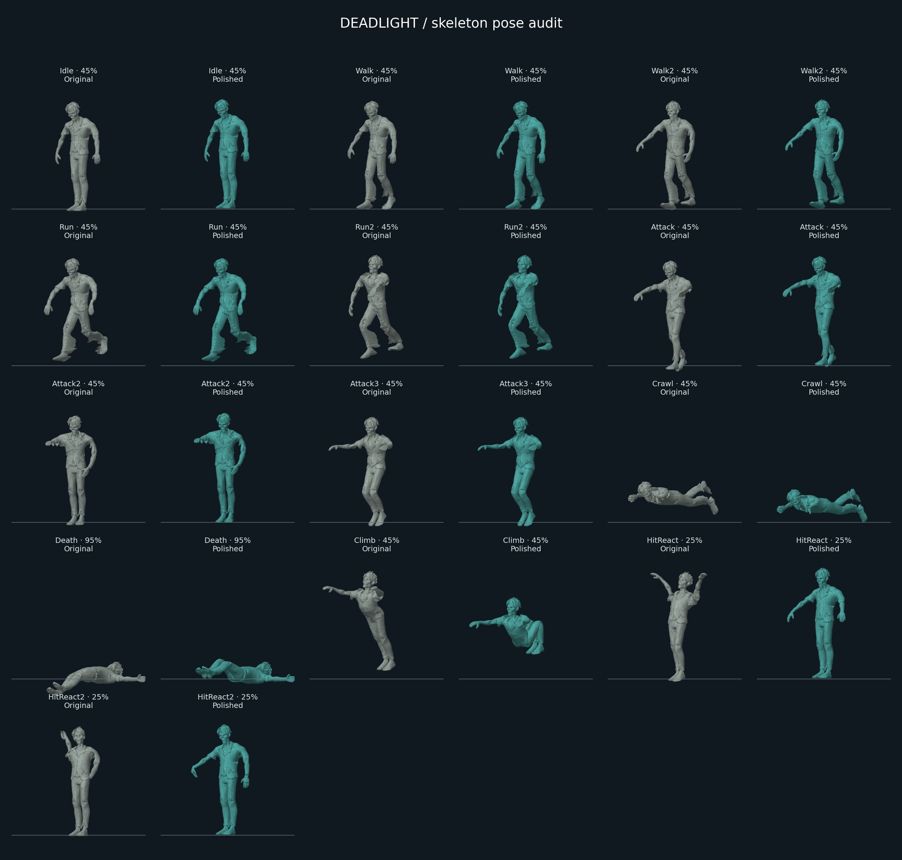
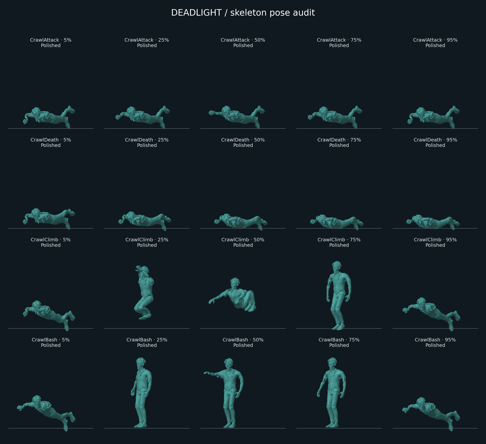

# Deadlight animation audit

Scope: all 13 source zombie clips, the procedural fallback, first-person poses across nine weapons, action transitions, window traversal, collision-driven movement, and related input/audio timing. Five additional crawler clips bring the shipped set to 18. The source character has 19 bones and about 45,000 triangles.

## Findings and changes

| Area | Finding | Change |
|---|---|---|
| Idle | A roughly one-second breathing loop and excessive root bob | 3.4-second breathing loop with smaller pelvis movement |
| Walk / Walk2 | Playback used desired velocity even when collision stopped movement; stride rates exaggerated sliding | Actual completed displacement drives a smoothed stride rate; stop hysteresis and phase-preserving gait transitions |
| Run / Run2 | Walk/run changes reset the cycle; crowded zombies separated by a fixed amount per frame | Preserve normalized gait phase; separation scales with elapsed time |
| Attack / Attack2 / Attack3 | Damage timing and clip durations were separately hard-coded | Contact phases use the selected clip duration; gameplay and playback share the attack clock |
| HitReact / HitReact2 | Full-body reactions replaced walking, including excessive raised arms | Masked additive upper-body reactions with reduced arm rotation, recovery envelope, and unchanged leg motion |
| Crawl | Crawl branch took precedence over attack and climb; floating support hands; duplicated height scaling | Action-first selection, lower body position, hand reach corrections, separate hitbox sizing, and bone-based aim target |
| CrawlIdle / CrawlAttack | Crawlers lacked a stationary pose and compatible attack | Added prone breathing and a reaching strike with a shared contact phase |
| CrawlBash | A prone crawler could not visibly reach barricade boards | Rise, reach the boards, and recover before entering the vault |
| Climb / CrawlClimb | The pose intersected both sill and lintel; crawling never yielded to climbing; traversal ended before the clip | Crouch/tuck corrections, explicit crawler rise and settle transitions, one traversal timeline, and a longer crawler landing distance |
| Death | Feet penetrated the floor; sinking began after 1.6 seconds despite a 2.5-second clip | Baked leg corrections; play the entire death clip plus a hold before sinking |
| CrawlDeath | Crawlers transitioned into an upright death | Added a prone collapse with settling limbs |
| Rise | No source Rise clip exists | Retained the ground-emergence effect with the appropriate standing or prone idle pose |
| First-person arms | Centered capsule meshes were placed at the shoulder/elbow rather than between joints | Center each segment and solve elbows with fixed-length two-bone IK |
| Reload | Every intermediate hand key stopped; insertion audio fired while the hand was at the belt | Shape-preserving cubic paths; audio aligned with extraction, insertion, and bolt phases |
| Knife / grenade | Damage/release occurred before the visible contact pose; actions could overlap | Shared contact phases and exclusive hand-action guards |
| Player movement | Camera bob and footsteps continued while pushing into walls | Drive both from completed movement |

## Verification

`npm test` includes 23 regression tests. They cover all animation assets, both postures across action states, additive hits, loop continuity, gait changes and stops, IK reach, continuous hand paths, action exclusivity, and mobile input recovery.

The window geometry test skins every vertex at 51 timeline samples for standing and crawling at both extreme spawn scales: **204 full-mesh poses**. Vertices within the wall's 0.6 m thickness must fit the actual frame opening, **1.06–2.54 m high**. Separate tests check the four wall orientations and run the entire crawler traversal at **30, 60, and 120 updates per second**. First-person tests check connected joints throughout all nine weapon reloads, knife motion, and grenade motion.

CPU contact sheets inspect source and corrected poses using the actual skinned mesh, with neutral colors for comparison. Original character and weapon GLBs are retained without rewriting their geometry or textures.

## Pose samples

Neutral CPU renders of the original and corrected skeletons, without game lighting or textures:

## Practical limits

The available cloud browser has WebGL disabled, so a live GPU playthrough and phone frame-rate measurements were not possible. The startup failure was observed and now explains when 3D graphics are unavailable. Rendering, lighting, touch comfort, and sustained mobile performance still need confirmation on real devices before merging the review build.

This pass preserves the original stylized zombie and procedural hands. It does not add motion capture, articulated fingers, terrain-aware runtime foot locking, or a physical ragdoll. The corpse clips and approximate body hit volumes remain authored approximations. The geometry regression covers the canonical vault path; arbitrary crowds, interrupted traversal, and all combat situations still benefit from device playtesting.
